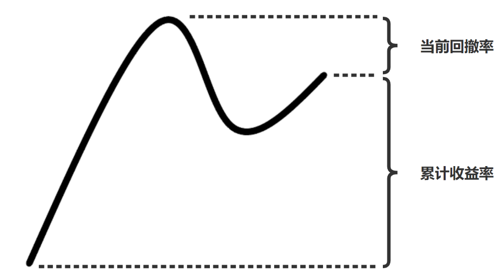

## 快速开始
python = 3.9


```shell
git clone https://github.com/liuandian/rl-stock.git
pip install -r requirements.txt
```


## 环境设计思路

**state_space 由三部分组成 :** 

1. 当前的现金

3. 每只股票的持仓量

4. 股票数 * 环境因素（总计15个）


**reward 的计算方式：**

* Reward = 累计收益率 - 当前回撤率

  

**action_space 的空间：**

* actions ∈ [-x, x]

* 正数表示买入，负数表示卖出，0 表示不进行买入卖出操作


## Reference

[FinRL](https://github.com/AI4Finance-LLC/FinRL)
