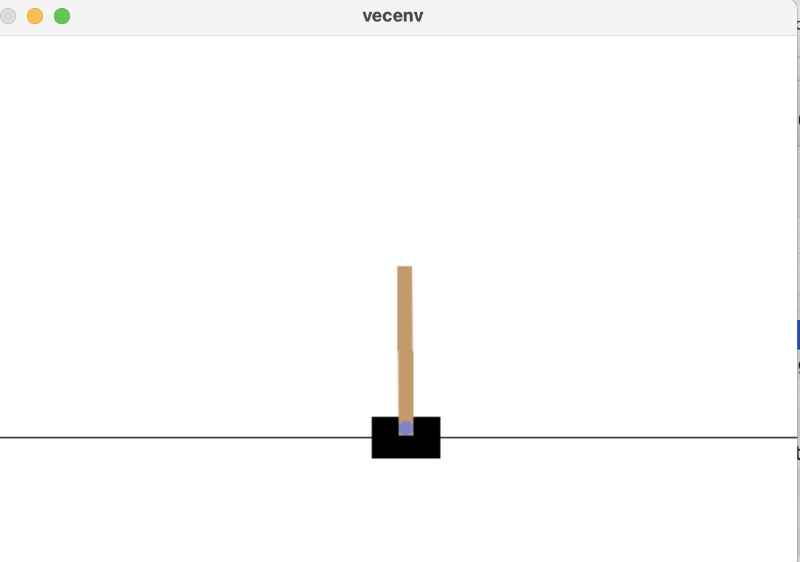

## 效果展示 


### 算法回测效果，以SAC为例


## 快速开始
conda 创建虚拟环境 python = 3.9
```shell
conda create -n rl-stock python=3.9 
conda activate rl-stock
```

```shell
git clone https://github.com/liuandian/rl-stock.git
cd rl-stock/
pip install -r requirements.txt
```

**TIPS**：

* 可以尝试运行stable_sample_test.py文件，查看环境是否安装成功

```shell
python stable_sample_test.py
```

能出现这个代表gymunasium,stable-baselines3安装成功



环境安装完成后，进入learn文件夹
```shell
cd learn/
```

## 下载数据

在终端中输入

```shell
python ./data.py
```

数据会保存在 `./data_file` 文件夹中


## 训练
一键训练（同时训练5个模型）
```shell
./start_train.sh
```

或手动在终端中输入以下命令尝试一下：

```shell
mkdir nohup
python -u ./trainer.py -m 'a2c' -tts 10000 
```

**TIPS**：

* 运行日志保存在 `./nohup` 文件夹中
* 运行完成后的模型保存在 `./train_file` 文件夹中


## 回测
一键回测
```shell
./start_trade.sh
```
或单个测试，在终端中输入

```shell
python -u ./trader.py -m 'a2c'
```
**TIPS**：

* 回测数据保存在 `./trade_file` 文件夹中


然后在plot_traded_result.ipynb文件中运行即可

## 环境设计思路

**state_space 由三部分组成 :** 

1. 当前的现金

3. 每只股票的持仓量

4. 股票数 * 环境因素


**reward 的计算方式：**

* Reward = 当前操作的对数收益率 - 当前回撤率 - 交易成本


**action_space 的空间：**

* actions ∈ [-1, 1]
如：
```python
action = [-0.5, 0.8, -1.0]
```
* 正数表示买入，负数表示卖出，0 表示不进行买入卖出操作


## Reference

[FinRL](https://github.com/AI4Finance-LLC/FinRL)

[StockRl](https://github.com/sunnyswag/StockRL.git)
